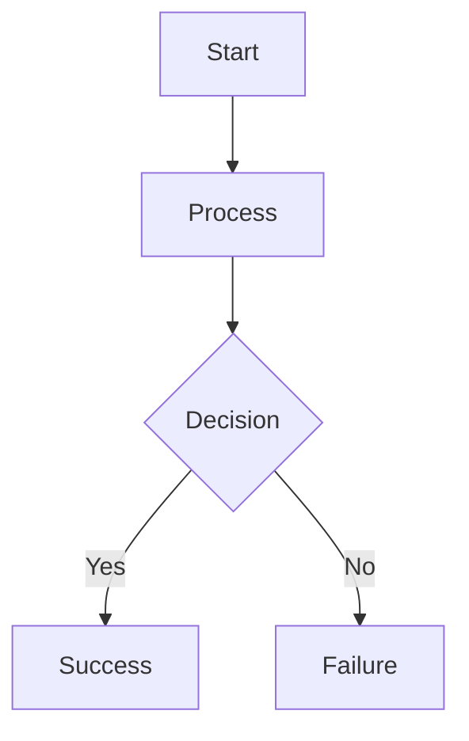
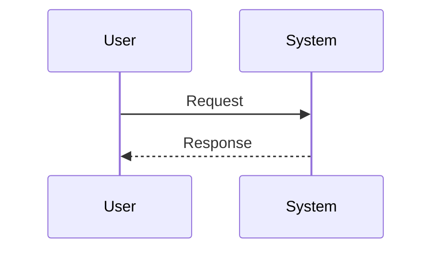
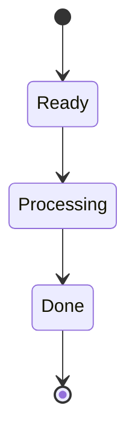

# Documentation Standards

## Overview

This document defines the standards and conventions for all documentation in the Go-Doc-Go project. Following these standards ensures consistency, maintainability, and clarity across all documentation types.

---

## Documentation Types

### 1. Problem → Resolution Documentation (Troubleshooting)

**Purpose**: Help users quickly solve specific issues

**Target Audience**: End users, operators

**Template**: `docs/_templates/troubleshooting-template.md`

**Structure**:
- Quick index of problems
- Problem description with symptoms
- Common causes
- Step-by-step solutions
- Prevention tips
- Related documentation links

**Format Requirements**:
- Use H2 (`##`) for each problem
- Include actual error messages in code blocks
- Provide working commands/config examples
- Include verification steps
- Link to related feature/configuration docs

**Length**: 1-2 pages per problem

---

### 2. Feature Documentation

**Purpose**: Explain what the system can do and how to use features

**Target Audience**: End users, developers

**Template**: `docs/_templates/feature-template.md`

**Structure**:
- Overview with key capabilities
- Quick start example
- Configuration reference
- Multiple examples (basic → advanced)
- Output format description
- Performance characteristics
- Limitations and workarounds
- Troubleshooting
- Related features

**Format Requirements**:
- Start with 2-3 sentence overview
- Always include working examples
- Use tables for configuration options
- Show expected output
- List all limitations honestly
- Link to related documentation

**Length**: 2-5 pages

---

### 3. Process/Workflow Documentation

**Purpose**: Show how things work end-to-end, explain system behavior

**Target Audience**: Developers, contributors

**Template**: `docs/_templates/process-template.md`

**Structure**:
- High-level overview
- Process flow diagram (Mermaid)
- Detailed step-by-step breakdown
- State transitions
- Sequence diagrams
- Concurrency considerations
- Performance characteristics
- Monitoring and observability
- Error handling
- Testing strategy

**Format Requirements**:
- Use Mermaid diagrams (GitHub-compatible)
- Explain "what", "why", and "how" for each step
- Include timing/duration estimates
- Document error paths
- Show data transformations
- Link to implementation code

**Length**: 1-3 pages

---

### 4. API Reference Documentation

**Purpose**: Technical reference for programmatic usage

**Target Audience**: Developers, contributors

**Structure**:
- Package overview
- Interface definitions
- Function signatures
- Parameter descriptions
- Return value descriptions
- Code examples
- Error conditions

**Format Requirements**:
- Use godoc conventions for Go code
- Include package-level doc.go files
- Document all exported types/functions
- Provide usage examples
- List all error types

**Length**: Variable, comprehensive coverage

---

### 5. Operations/DevOps Documentation

**Purpose**: Guide for deploying and operating the system

**Target Audience**: Operators, SREs, DevOps

**Structure**:
- Prerequisites
- Step-by-step instructions
- Configuration files
- Verification steps
- Monitoring setup
- Troubleshooting
- Security considerations

**Format Requirements**:
- Checklist format for complex procedures
- Include all required configuration
- Show example deployments
- Document resource requirements
- Provide health check commands

**Length**: 3-10 pages

---

## Writing Style Guidelines

### General Principles

1. **Be Concise**: Respect the reader's time. Use clear, direct language.
2. **Be Accurate**: Test all examples. Verify all commands work.
3. **Be Complete**: Don't assume prior knowledge. Link to prerequisite docs.
4. **Be Honest**: Document limitations, known issues, and trade-offs.
5. **Be Helpful**: Anticipate questions. Provide troubleshooting.

### Voice and Tone

- **Active Voice**: "The parser extracts text" (not "Text is extracted by the parser")
- **Present Tense**: "The worker claims jobs" (not "The worker will claim jobs")
- **Direct Address**: "You can configure" (for user-facing docs)
- **Third Person**: "The system processes" (for technical docs)
- **No Superlatives**: Avoid "amazing", "incredible", "best" - state facts

### Formatting

#### Headings

- **H1** (`#`): Document title only (one per file)
- **H2** (`##`): Major sections
- **H3** (`###`): Subsections
- **H4** (`####`): Sub-subsections (use sparingly)

#### Code Blocks

Always specify language for syntax highlighting:

````markdown
```go
func Example() {}
```

```toml
[section]
option = "value"
```

```bash
bin/goworker --config config.toml
```
````

#### Lists

- **Unordered lists**: Use `-` for consistency
- **Ordered lists**: Use `1.` and let Markdown auto-number
- **Nested lists**: Indent 2 spaces

#### Tables

Use tables for structured data (configuration options, error types, etc.):

```markdown
| Column 1 | Column 2 | Column 3 |
|----------|----------|----------|
| Value A  | Value B  | Value C  |
```

#### Emphasis

- **Bold** (`**text**`): Important terms, UI elements, emphasis
- *Italic* (`*text*`): Minimal use, usually for variable names in prose
- `Code` (`` `text` ``): Commands, file paths, config keys, code references

---

## Code Examples

### Requirements

1. **Working Examples**: All code examples must be tested and working
2. **Complete Examples**: Include all necessary imports, setup, teardown
3. **Realistic Examples**: Use realistic scenarios, not contrived edge cases
4. **Commented Examples**: Add comments explaining non-obvious parts
5. **Output Examples**: Show expected output after examples

### Go Code Examples

```go
// Package example demonstrates proper godoc format.
//
// This is a longer description that explains what the package does,
// when to use it, and how it fits into the larger system.
//
// Example usage:
//
//	parser := example.NewParser()
//	result, err := parser.Parse(data)
//	if err != nil {
//		log.Fatal(err)
//	}
package example

// Parser extracts structured data from documents.
//
// The Parser interface is implemented by all format-specific parsers
// (PDF, DOCX, HTML, etc.). Each parser returns Universal Elements.
type Parser interface {
	// Parse processes the input data and returns parsed elements.
	//
	// Parameters:
	//   - data: Raw document bytes to parse
	//
	// Returns:
	//   - *ParseResult: Structured elements and metadata
	//   - error: Parsing error if the document is invalid
	//
	// Example:
	//
	//	data, _ := os.ReadFile("document.pdf")
	//	result, err := parser.Parse(data)
	//	if err != nil {
	//		return fmt.Errorf("parse failed: %w", err)
	//	}
	Parse(data []byte) (*ParseResult, error)
}
```

### Configuration Examples

Always annotate configuration with comments:

```toml
# Worker configuration
[worker]
# Number of concurrent document processors (default: 4)
# Recommendation: Set to number of CPU cores
workers = 8

# Maximum documents to claim per batch (default: 10)
# Higher values improve throughput but increase memory usage
batch_size = 50

# Document claim timeout in seconds (default: 300)
# How long a worker can hold a document before it's reclaimed
claim_timeout = 600
```

### Command Examples

Show command, expected output, and explanation:

```bash
# Build the worker binary
go build -o bin/goworker ./cmd/worker

# Expected output:
# (No output on success)

# Run the worker with verbose logging
bin/goworker --config config.toml --log-level debug

# Expected output:
# [INFO] Worker started: workers=8
# [DEBUG] Claimed document: doc_id=abc123
# [INFO] Processed document: doc_id=abc123 duration=1.2s
```

---

## Diagrams

### Mermaid Diagrams

Use Mermaid for all diagrams (GitHub-compatible):

**Flow Diagrams**:


**Sequence Diagrams**:


**State Diagrams**:


### ASCII Diagrams

For simple data flows:

```
Input → Parser → Elements → Storage → Output
          ↓
      Relationships
```

---

## Cross-Referencing

### Internal Links

Use relative links for internal documentation:

```markdown
See [Configuration Guide](../configuration/README.md) for details.

Refer to [Element Types](../universal-element-types.md#heading-element).

Check [Troubleshooting](../troubleshooting/parsing-errors.md#pdf-parsing) if parsing fails.
```

### Code References

Reference code with file:line notation:

```markdown
Parsing logic is in `go/internal/parser/pdf.go:145`

See the Parser interface at `go/internal/parser/parser.go:25`
```

### External Links

Use descriptive link text:

```markdown
[DuckDB Documentation](https://duckdb.org/docs/)

[Go Error Handling Best Practices](https://go.dev/blog/error-handling-and-go)
```

---

## Documentation Organization

### File Naming

- Use kebab-case: `parsing-errors.md`, `worker-coordination.md`
- Be descriptive: Avoid abbreviations
- Use nouns for concepts: `relationships.md`, `configuration.md`
- Use verbs for processes: `adding-parsers.md`, `deploying-to-kubernetes.md`

### Directory Structure

```
docs/
├── README.md                    # Central documentation hub
├── DOCUMENTATION_STANDARDS.md   # This file
├── getting-started/             # New user onboarding
├── features/                    # Feature capabilities
│   ├── parsing/                # Parser documentation
│   ├── discovery/              # Discovery/crawling
│   ├── ontology/               # Ontology extraction
│   └── ...
├── processes/                   # Workflows and processes
├── troubleshooting/            # Problem resolution
├── reference/                   # Technical reference
│   ├── api/                    # API documentation
│   └── data-models/            # Data schemas
├── operations/                  # DevOps guides
│   └── deployment/             # Deployment guides
├── development/                 # Contributor guides
├── architecture/                # System design docs
├── configuration/               # Configuration reference
└── _templates/                  # Documentation templates
```

### README Files

Every directory should have a README.md that:
- Lists contents of the directory
- Provides overview of the topic
- Links to key documents
- Suggests reading order (if applicable)

---

## Maintenance

### Keeping Docs Current

1. **Update with Code Changes**: Documentation is part of the PR
2. **Mark Deprecated Features**: Use callouts for deprecation warnings
3. **Archive Old Docs**: Move outdated docs to `docs/archive/`
4. **Version Documentation**: Indicate which version docs apply to
5. **Test Examples Regularly**: Run example code as part of CI

### Review Checklist

Before merging documentation:

- [ ] All code examples tested and working
- [ ] All links valid (no 404s)
- [ ] Follows template structure (if applicable)
- [ ] Spelling and grammar checked
- [ ] Diagrams render correctly on GitHub
- [ ] Cross-references are accurate
- [ ] Adheres to style guidelines

---

## Special Callouts

Use blockquotes for special notices:

**Note** (general information):
> **Note**: This feature requires Go 1.21 or later.

**Warning** (important caution):
> **Warning**: This operation cannot be undone. Make a backup first.

**Tip** (helpful suggestion):
> **Tip**: For better performance, increase the batch size to 100.

**Deprecated** (sunset notice):
> **Deprecated**: Use the new `discovery` configuration instead. This option will be removed in v2.0.

---

## Versioning

### Documentation Versions

- Documentation lives in the main branch
- Version-specific docs in `docs/versions/v1.0/`, etc. (if needed)
- Indicate version applicability at the top of each doc:

```markdown
# Feature Name

> **Applies to**: v1.5 and later
```

### Changelog Integration

- Document breaking changes in docs when they happen
- Update migration guides in `docs/operations/upgrade-migration.md`
- Link to GitHub releases for version history

---

## Godoc Standards

### Package Documentation

Every package must have a `doc.go` file:

```go
// Package parser provides document parsing for various file formats.
//
// The parser package implements format-specific parsers for PDF, DOCX, HTML,
// and other document types. All parsers implement the Parser interface and
// return Universal Elements compatible with the UDML specification.
//
// # Usage
//
// Create a parser for the document type:
//
//	parser := parser.NewPdfParser()
//	result, err := parser.Parse(documentBytes)
//
// # Element Types
//
// Parsers produce elements with types from the ElementType enum:
//   - heading: Document headings (h1, h2, etc.)
//   - paragraph: Text paragraphs
//   - table: Tabular data
//   - image: Images and figures
//
// See the Universal Element Types documentation for the complete list.
//
// # Error Handling
//
// Parsers return errors for:
//   - Invalid file formats
//   - Corrupted documents
//   - Unsupported features
//
// Errors are wrapped with context using fmt.Errorf with %w.
package parser
```

### Function Documentation

```go
// Parse extracts structured elements from a PDF document.
//
// The function processes the PDF file and returns Universal Elements
// representing the document structure (headings, paragraphs, tables, etc.)
// and relationships between elements.
//
// Parameters:
//   - data: Raw PDF file bytes
//
// Returns:
//   - *ParseResult containing elements and metadata
//   - error if the PDF is invalid or parsing fails
//
// Example:
//
//	data, err := os.ReadFile("document.pdf")
//	if err != nil {
//		log.Fatal(err)
//	}
//	result, err := parser.Parse(data)
//	if err != nil {
//		log.Fatalf("parse failed: %v", err)
//	}
//	fmt.Printf("Extracted %d elements\n", len(result.Elements))
func (p *PdfParser) Parse(data []byte) (*ParseResult, error) {
	// Implementation
}
```

---

## Examples Directory

### Structure

```
examples/
├── example-name/
│   ├── README.md           # What this example demonstrates
│   ├── config.toml         # Working configuration
│   ├── run.sh              # Script to run the example
│   ├── input/              # Sample input files
│   └── expected_output/    # Expected results
```

### README Requirements

Each example README must include:
1. **What it demonstrates**: Clear description
2. **Prerequisites**: Required software, data, etc.
3. **How to run**: Step-by-step instructions
4. **Expected output**: What success looks like
5. **Key concepts**: What to learn from this example
6. **Next steps**: What to try next

---

## Accessibility

### Writing for Non-Native Speakers

- Use simple sentence structure
- Avoid idioms and colloquialisms
- Define technical terms on first use
- Link to the glossary for jargon

### Writing for Screen Readers

- Use descriptive link text (not "click here")
- Provide alt text for images (when Markdown supports it)
- Use semantic heading structure (H1 → H2 → H3, no skips)
- Use tables with headers for tabular data

---

## Tools and Automation

### Recommended Tools

- **Markdown Linter**: `markdownlint` for consistency
- **Spell Checker**: `aspell` or IDE spell check
- **Link Checker**: `markdown-link-check` for broken links
- **Diagram Validation**: Mermaid CLI or online editor

### Pre-Commit Checks

Recommended pre-commit hooks for documentation:
```bash
# Check markdown formatting
markdownlint docs/**/*.md

# Check spelling
find docs -name '*.md' -exec aspell check {} \;

# Validate links (requires network)
markdown-link-check docs/**/*.md
```

---

## Questions or Suggestions?

If you have questions about documentation standards or suggestions for improvements:

1. Open a GitHub Issue with the `documentation` label
2. Propose changes in a pull request
3. Discuss in project communication channels

---

## Revision History

| Date | Version | Changes |
|------|---------|---------|
| 2025-10-29 | 1.0 | Initial documentation standards |
