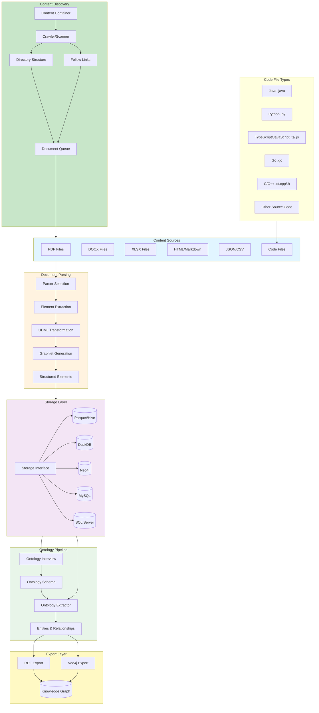
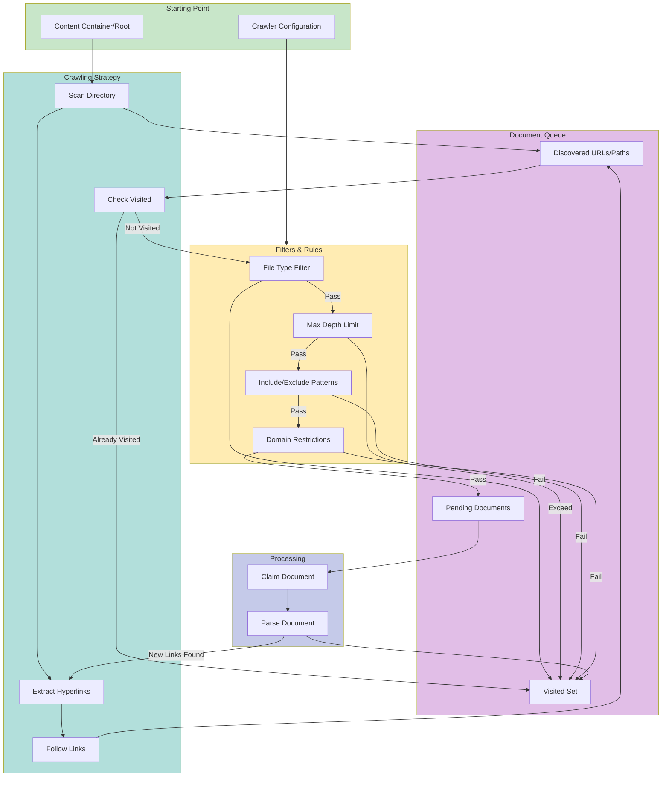
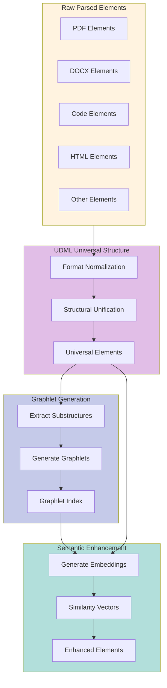
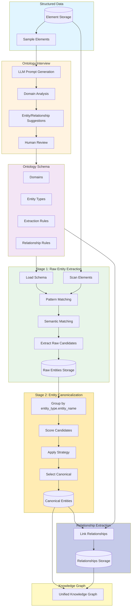
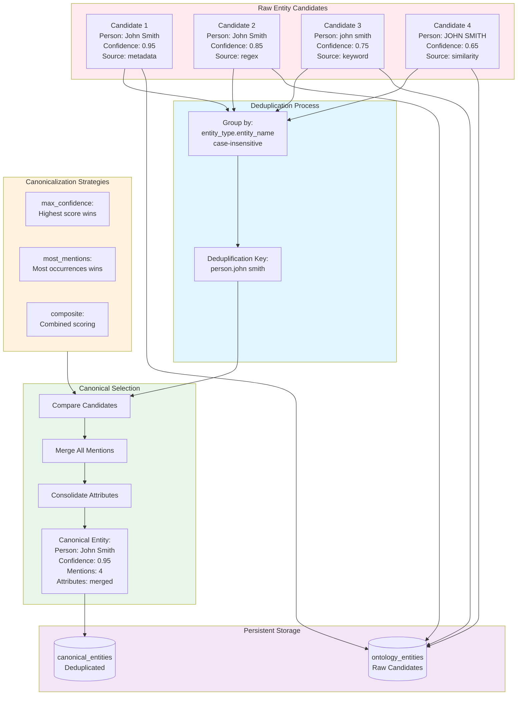
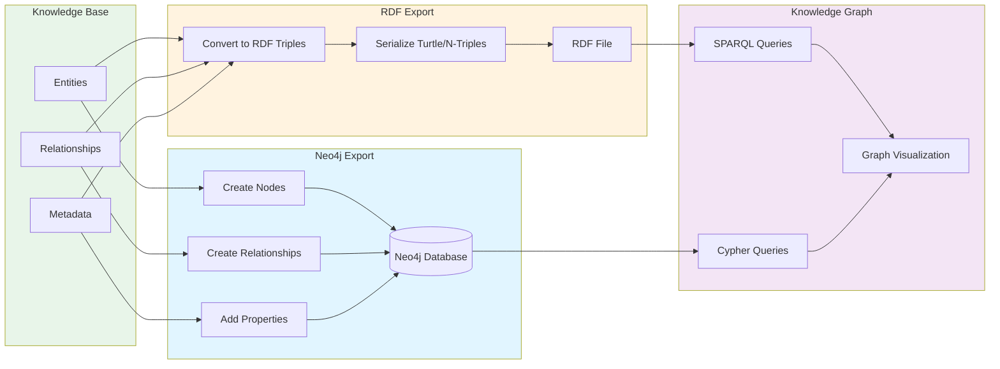
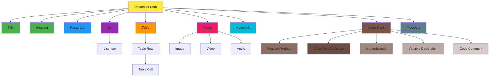
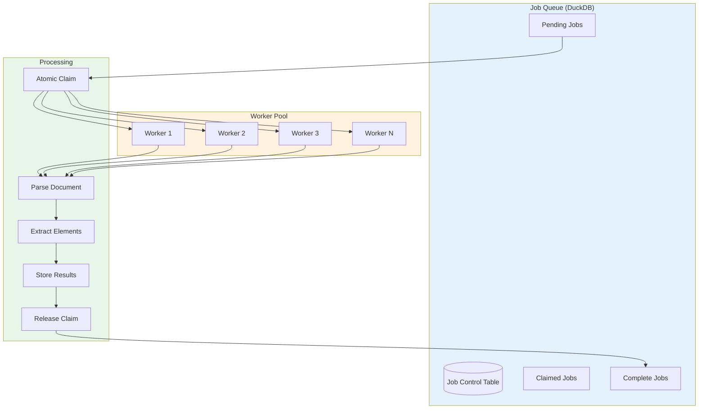

# Go-Doc-Go Process Diagrams

## High-Level System Flow

## Content Discovery & Crawling

## Detailed Document Processing Pipeline

```mermaid
flowchart LR
    subgraph input["1. Content Source"]
        DOC[Document File]
        META[Metadata]
    end

    subgraph parse["2. Document Parsing"]
        DETECT[Type Detection]
        PARSER[Parser Instance]
        subgraph elements["Extract Elements"]
            TITLE[Titles]
            PARA[Paragraphs]
            TABLE[Tables]
            LINK[Hyperlinks]
            IMG[Images]
            CODE_ELEM[Code Blocks]
            FUNC[Functions/Methods]
            CLASS[Classes/Types]
        end
    end

    subgraph udml_phase["3. UDML Transformation"]
        UDML_CONV[Universal Structure]
        GRAPHLET_GEN[Graphlet Generation]
        SEM_ENHANCE[Semantic Enhancement]
    end

    subgraph structure["4. Structured Elements"]
        ELEM[Element Records]
        REL[Relationships]
        HIER[Hierarchy]
    end

    subgraph store["5. Storage Backends"]
        STORAGE_INT[Storage Interface]
        PQ[(Parquet/Hive)]
        DB[(DuckDB)]
        MYSQL_S[(MySQL)]
        NEO_S[(Neo4j)]
        SQL_S[(SQL Server)]
    end

    DOC --> DETECT
    META --> DETECT
    DETECT --> PARSER
    PARSER --> elements
    elements --> UDML_CONV
    UDML_CONV --> GRAPHLET_GEN
    GRAPHLET_GEN --> SEM_ENHANCE
    SEM_ENHANCE --> ELEM
    ELEM --> REL
    REL --> HIER
    HIER --> STORAGE_INT
    STORAGE_INT -.-> PQ
    STORAGE_INT -.-> DB
    STORAGE_INT -.-> MYSQL_S
    STORAGE_INT -.-> NEO_S
    STORAGE_INT -.-> SQL_S

    style input fill:#e3f2fd
    style parse fill:#fff3e0
    style udml_phase fill:#e1bee7
    style structure fill:#f3e5f5
    style store fill:#e8f5e9
```

## UDML Transformation Phase

## Ontology Extraction Pipeline

## Entity Canonicalization Detail

## Export Process

## Complete End-to-End Flow

```mermaid
flowchart TB
    START([Content Container])

    subgraph stage0["Stage 0: Content Discovery"]
        CRAWL[Crawl & Discover]
        QUEUE_DOCS[Queue Documents]
        FILTER[Apply Filters]
    end

    subgraph stage1["Stage 1: Document Processing"]
        CLAIM[Claim Document]
        PARSE[Parse & Extract Elements]
        UDML_TRANSFORM[UDML Transform]
        STORE1[(Store Elements)]
    end

    subgraph stage2["Stage 2: Ontology Design"]
        SAMPLE[Sample Elements]
        INTERVIEW[LLM-Assisted Interview]
        DESIGN[Design Schema]
        VALIDATE[Validate Schema]
    end

    subgraph stage3["Stage 3: Knowledge Extraction"]
        subgraph stage3a["3a: Raw Entity Extraction"]
            LOAD[Load Schema]
            EXTRACT[Extract Raw Entities]
            STORE_RAW[(Store Raw Entities)]
        end
        subgraph stage3b["3b: Canonicalization"]
            CONSOLIDATE[Consolidate Entities]
            CANONICAL[(Canonical Entities)]
        end
        subgraph stage3c["3c: Relationships"]
            MATCH[Match Relationships]
            STORE_REL[(Store Relationships)]
        end
    end

    subgraph stage4["Stage 4: Export"]
        EXPORT_RDF[Export to RDF]
        EXPORT_NEO[Export to Neo4j]
    end

    END([Knowledge Graph])

    START --> CRAWL
    CRAWL --> QUEUE_DOCS
    QUEUE_DOCS --> FILTER
    FILTER --> CLAIM
    CLAIM --> PARSE
    PARSE --> UDML_TRANSFORM
    UDML_TRANSFORM --> STORE1
    STORE1 --> SAMPLE
    PARSE -->|Discover New Links| CRAWL

    SAMPLE --> INTERVIEW
    INTERVIEW --> DESIGN
    DESIGN --> VALIDATE
    VALIDATE -->|Invalid| INTERVIEW
    VALIDATE -->|Valid| LOAD

    LOAD --> EXTRACT
    STORE1 --> EXTRACT
    EXTRACT --> STORE_RAW
    STORE_RAW -->|All Workers Complete| CONSOLIDATE
    CONSOLIDATE --> CANONICAL
    CANONICAL --> MATCH
    MATCH --> STORE_REL

    CANONICAL --> EXPORT_RDF
    STORE_REL --> EXPORT_RDF
    CANONICAL --> EXPORT_NEO
    STORE_REL --> EXPORT_NEO
    EXPORT_RDF --> END
    EXPORT_NEO --> END

    style stage0 fill:#c8e6c9
    style stage1 fill:#e3f2fd
    style stage2 fill:#fff3e0
    style stage3 fill:#e8f5e9
    style stage4 fill:#f3e5f5
    style START fill:#a5d6a7
    style END fill:#ffccbc
```

## Element Type Hierarchy

## Worker Architecture (Distributed Processing)

