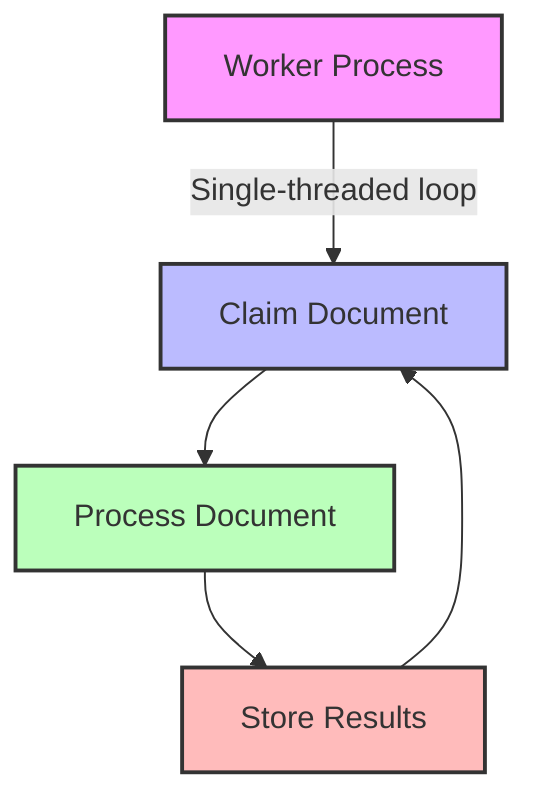
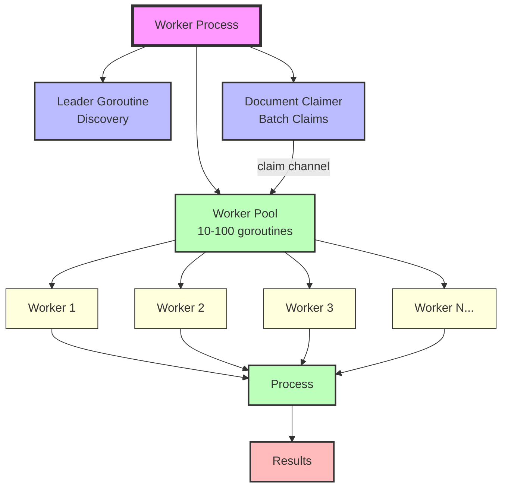

# Goroutine-Based Worker Design

## Current Architecture



## Proposed Goroutine Architecture



## Key Changes

### 1. Add Worker Pool Configuration
```go
// Config holds worker configuration
type Config struct {
    WorkerID          string
    NumWorkers        int    // NEW: number of concurrent goroutine workers
    BatchClaimSize    int    // NEW: claim N documents at once
    JobControlConfig  jobcontrol.Config
    ContentSources    []map[string]interface{}
    AnalyticsConfigs  []map[string]interface{}
    MaxDocuments      int
}
```go

### 2. Worker Pool Implementation
```go
// WorkerPool manages multiple goroutine workers
type WorkerPool struct {
    numWorkers    int
    workChannel   chan *jobcontrol.DocumentInfo  // Jobs to process
    resultChannel chan ProcessResult              // Results
    wg            sync.WaitGroup
    ctx           context.Context
}

func (w *Worker) RunWithPool() error {
    // Create work channel
    workChan := make(chan *jobcontrol.DocumentInfo, w.config.NumWorkers*2)
    resultChan := make(chan ProcessResult, w.config.NumWorkers)

    // Start worker goroutines
    for i := 0; i < w.config.NumWorkers; i++ {
        w.wg.Add(1)
        go w.workerGoroutine(i, workChan, resultChan)
    }

    // Start document claimer goroutine
    go w.documentClaimerGoroutine(workChan)

    // Start result handler goroutine
    go w.resultHandlerGoroutine(resultChan)

    // Wait for completion
    w.wg.Wait()
    return nil
}
```go

### 3. Individual Worker Goroutine
```go
func (w *Worker) workerGoroutine(id int, workChan <-chan *jobcontrol.DocumentInfo, resultChan chan<- ProcessResult) {
    defer w.wg.Done()

    log.Printf("Worker goroutine %d started", id)

    for {
        select {
        case docInfo := <-workChan:
            if docInfo == nil {
                return // Shutdown signal
            }

            // Process document
            success := w.processDocument(docInfo)

            // Send result
            resultChan <- ProcessResult{
                DocID:   docInfo.DocID,
                Success: success,
            }

        case <-w.ctx.Done():
            return
        }
    }
}
```go

### 4. Batch Document Claimer
```go
func (w *Worker) documentClaimerGoroutine(workChan chan<- *jobcontrol.DocumentInfo) {
    ticker := time.NewTicker(100 * time.Millisecond)
    defer ticker.Stop()

    for {
        select {
        case <-ticker.C:
            // Claim multiple documents at once
            for i := 0; i < w.config.BatchClaimSize; i++ {
                docInfo, err := w.jobControl.ClaimNextDocument(w.workerID)
                if err != nil {
                    log.Printf("Failed to claim document: %v", err)
                    break
                }
                if docInfo == nil {
                    break // No more documents
                }

                // Send to worker pool
                workChan <- docInfo
            }

        case <-w.ctx.Done():
            close(workChan)
            return
        }
    }
}
```

## Performance Comparison

### Single-threaded (Current)
```
Throughput: ~10-50 docs/sec per process
Bottleneck: Document claiming + processing in sequence
Memory: 40MB per process
Scale: Add more processes
```python

### Goroutine Pool (Proposed)
```python
Throughput: ~100-500 docs/sec per process (with 10 workers)
Bottleneck: I/O (Python shims, Parquet writes)
Memory: 40MB + ~10MB for goroutine workers
Scale: Add more goroutines OR more processes
```bash

## Migration Path

### Phase 1: Add --workers flag (backward compatible)
```bash
## Default: 1 worker (current behavior)
./goworker --config config.toml

## New: 10 concurrent workers
./goworker --config config.toml --workers 10
```toml

### Phase 2: Optimize batch claiming
- Claim 10-50 documents at once
- Reduces DB lock contention by 10-50x

### Phase 3: Native analytics (remove Python shim)
- Biggest bottleneck after goroutines
- Parquet writes are I/O bound, benefit from batching

## Recommended Configuration

```yaml
## For single machine:
workers: 10-20        # Number of goroutine workers
batch_claim_size: 10  # Claim N docs at once

## For distributed (multiple machines):
## Run 2-3 processes per machine, each with 5-10 workers
```

## When to Use What

**Single Process (Current):**
- ✅ Development/testing
- ✅ Low document volume (<100/hour)
- ✅ Need simple debugging

**Goroutine Pool (Proposed):**
- ✅ High document volume (>1000/hour)
- ✅ Single machine deployment
- ✅ Want maximum throughput per process

**Multiple Processes:**
- ✅ Distributed across machines
- ✅ Fault tolerance requirements
- ✅ Need to scale horizontally

**Hybrid (Best):**
- ✅ 2-3 processes per machine (fault tolerance)
- ✅ 5-10 goroutines per process (concurrency)
- ✅ Total: 10-30 concurrent workers per machine
