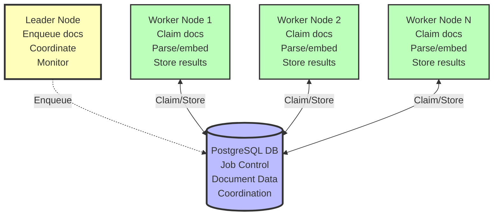

# Scaling Guide: Horizontal Document Ingestion

Go-Doc-Go's massively horizontal ingestion pipeline can process thousands of documents concurrently using distributed job control and elected leader coordination.

## Architecture Overview



## Key Concepts

### Elected Leader Pattern
- **One leader** per processing run manages the queue
- **Multiple workers** claim and process documents
- **Automatic failover** if leader goes down
- **Identical workers** - no special configuration needed

### Atomic Document Claiming
- PostgreSQL row-level locking ensures no duplicate processing
- **Claims expire** automatically (5-minute timeout)
- **Heartbeat system** keeps active claims alive
- **Failure recovery** - crashed workers release claims automatically

### Configuration-Based Coordination
- **Run ID** generated from configuration hash
- **Identical configs** = same run = workers coordinate automatically
- **Different configs** = separate runs = no interference

## Deployment Patterns

### Single Machine (Development)

```toml
## config.toml
[storage]
backend = "postgresql"
host = "localhost"
database = "go_doc_go"

## Simple multi-process
[[content_sources]]
name = "documents"
type = "file"
base_path = "./docs"

[workers]
max_workers = 4  # Use all CPU cores
worker_timeout = 300  # 5 minutes
```bash

```bash
## Start multiple workers on same machine
../bin/goworker --config config.toml --workers 4
```bash

### Multi-Machine Cluster

**Shared Configuration:**
```toml
## cluster_config.toml (identical on all nodes)
[storage]
backend = "postgresql"
host = "postgres-cluster.internal"
database = "go_doc_go_prod"
pool_size = 20

[[content_sources]]
name = "s3_documents"
type = "s3"
bucket = "company-docs"

[embedding]
provider = "fastembed"
model = "BAAI/bge-small-en-v1.5"
batch_size = 64

[workers]
worker_id = "${HOSTNAME}"  # Unique per machine
heartbeat_interval = 30    # seconds
claim_timeout = 300        # 5 minutes
```bash

**Deployment:**
```bash
## Node 1
export HOSTNAME=worker-01
../bin/goworker --config cluster_config.toml --workers 8

## Node 2
export HOSTNAME=worker-02
../bin/goworker --config cluster_config.toml --workers 8

## Node N
export HOSTNAME=worker-N
../bin/goworker --config cluster_config.toml --workers 8
```toml

### Kubernetes Deployment

```yaml
## k8s/go-doc-go-workers.yaml
apiVersion: apps/v1
kind: Deployment
metadata:
  name: go-doc-go-workers
spec:
  replicas: 5  # 5 worker pods
  selector:
    matchLabels:
      app: go-doc-go-worker
  template:
    metadata:
      labels:
        app: go-doc-go-worker
    spec:
      containers:
      - name: worker
        image: go-doc-go:latest
        command: ["go-doc-go", "ingest", "config.toml", "--workers", "4"]
        env:
        - name: HOSTNAME
          valueFrom:
            fieldRef:
              fieldPath: metadata.name
        - name: DB_PASSWORD
          valueFrom:
            secretKeyRef:
              name: postgres-secret
              key: password
        resources:
          requests:
            memory: "2Gi"
            cpu: "1"
          limits:
            memory: "4Gi" 
            cpu: "2"
        volumeMounts:
        - name: config
          mountPath: /app/config.toml
          subPath: config.toml
      volumes:
      - name: config
        configMap:
          name: go-doc-go-config
---
apiVersion: v1
kind: ConfigMap
metadata:
  name: go-doc-go-config
data:
  config.toml: |
    storage:
      backend: "postgresql"
      host: "postgres-service"
      database: "go_doc_go"
      username: "postgres"
      password: "${DB_PASSWORD}"
    # ... rest of config
```

## Performance Optimization

### Worker Configuration

```toml
[workers]
## Worker identity
worker_id = "${HOSTNAME}-${WORKER_ID}"

## Concurrency
max_workers = 8            # Parallel workers per node
max_concurrent_docs = 32   # Documents per worker can handle

## Timing
claim_timeout = 300        # 5 minutes per document
heartbeat_interval = 30    # Keep-alive frequency
poll_interval = 5          # How often to check for new work

## Batching
claim_batch_size = 10      # Claim multiple docs at once
process_batch_size = 5     # Process docs in batches

## Resource limits
max_memory_per_worker = "1GB"
max_cpu_per_worker = 1.0
```toml

### Database Connection Pool

```toml
[storage]
backend = "postgresql"
host = "postgres-cluster"

## Connection pooling for multiple workers
pool_size = 50             # Total connections per node
max_overflow = 20          # Additional connections if needed
pool_timeout = 30          # Timeout waiting for connection
pool_recycle = 3600        # Recycle connections hourly

## Statement optimization
use_prepared_statements = true
statement_cache_size = 1000
```toml

### Embedding Optimization

```toml
[embedding]
provider = "fastembed"      # 15x faster than transformers
model = "BAAI/bge-small-en-v1.5"

## Batching for GPU efficiency
batch_size = 64            # Process many docs at once
max_batch_wait = 100       # ms to wait for full batch

## Memory management
max_sequence_length = 512  # Truncate long documents
embedding_cache_size = 10000

## GPU configuration (if available)
device = "cuda"            # or "cpu", "mps"
precision = "float16"      # Reduce memory usage
```

## Monitoring and Observability

### Built-in Metrics

```python
from go_doc_go import Config, get_processing_stats

config = Config("config.toml")
stats = get_processing_stats(config)

print(f"Active workers: {stats['active_workers']}")
print(f"Queue depth: {stats['queue_depth']}")  
print(f"Documents/second: {stats['throughput']}")
print(f"Average processing time: {stats['avg_processing_time']}s")
print(f"Failed documents: {stats['failed_count']}")
```toml

### Health Monitoring

```toml
## config.toml
[monitoring]
enabled = true
metrics_port = 9090        # Prometheus metrics
health_check_port = 8080   # Health endpoint

## Alerting thresholds
max_queue_depth = 10000
max_processing_time = 600  # 10 minutes
min_throughput = 10        # docs/second

[logging]
level = "INFO"
structured = true          # JSON logs for parsing
include_worker_id = true
```json

### Prometheus Metrics

Expose metrics for monitoring:

```go
## Document processing
go_doc_go_documents_total{status="completed|failed|claimed"}
go_doc_go_processing_duration_seconds{quantile="0.5|0.95|0.99"}
go_doc_go_queue_depth_total
go_doc_go_workers_active

## System resources  
go_doc_go_memory_usage_bytes{worker_id="worker-01"}
go_doc_go_cpu_usage_ratio{worker_id="worker-01"}
go_doc_go_db_connections_active{worker_id="worker-01"}
```go

## Failure Handling

### Automatic Recovery

```toml
[workers]
## Retry configuration
max_retries = 3
retry_delay = 60           # seconds between retries
exponential_backoff = true

## Failure handling
dead_letter_queue = true   # Store failed documents
max_failures_per_hour = 10
circuit_breaker_threshold = 5  # Stop worker after N failures

## Cleanup
cleanup_completed_jobs = true
cleanup_after_hours = 24
```bash

### Manual Recovery

```bash
## Check failed documents
go-doc-go status config.toml --show-failures

## Retry failed documents
go-doc-go retry config.toml --doc-ids "doc1,doc2,doc3"

## Reprocess from dead letter queue
go-doc-go retry config.toml --from-dead-letter-queue

## Reset stuck claims (emergency)  
go-doc-go reset-claims config.toml --older-than 1h
```toml

## Performance Benchmarks

### Target SLAs

| Metric | Target | Configuration |
|--------|---------|---------------|
| **Document claiming latency** | < 10ms | PostgreSQL row locking |
| **Sustained throughput** | > 1000 docs/sec | 10 workers, batch processing |
| **Memory per worker** | < 100MB base | Streaming processing |
| **Maximum workers** | 50 concurrent | Connection pooling |
| **Claim timeout** | 5 minutes | Configurable per workload |

### Scaling Test Results

```bash
## Benchmark different configurations
go-doc-go benchmark config.toml \
  --documents 10000 \
  --workers 1,2,4,8,16 \
  --duration 300s \
  --output benchmark_results.json
```json

Example results:
```json
{
  "1_worker": {"throughput": 45, "latency_p95": 2300},
  "2_workers": {"throughput": 87, "latency_p95": 1200}, 
  "4_workers": {"throughput": 165, "latency_p95": 850},
  "8_workers": {"throughput": 312, "latency_p95": 600},
  "16_workers": {"throughput": 580, "latency_p95": 450}
}
```

## Production Deployment Checklist

### Infrastructure Setup

- [ ] **PostgreSQL cluster** with sufficient connection limits
- [ ] **Shared configuration** accessible to all workers
- [ ] **Network connectivity** between all nodes and database
- [ ] **Resource monitoring** (CPU, memory, disk, network)
- [ ] **Log aggregation** (ELK stack, Splunk, etc.)

### Configuration Validation

- [ ] **Connection pooling** properly configured
- [ ] **Worker limits** set based on available resources
- [ ] **Timeouts** appropriate for document complexity
- [ ] **Retry logic** configured for expected failure rates
- [ ] **Health checks** and alerting configured

### Deployment Steps

```bash
## 1. Test configuration
go-doc-go validate config.toml

## 2. Initialize database schema
go-doc-go init-db config.toml

## 3. Start with single worker (test)
go-doc-go ingest config.toml --workers 1 --limit 100

## 4. Scale up gradually
go-doc-go ingest config.toml --workers 2
go-doc-go ingest config.toml --workers 4
## ... monitor and increase

## 5. Full production deployment
go-doc-go ingest config.toml --workers 16
```bash

### Operational Procedures

```bash
## Monitor queue status
watch -n 5 'go-doc-go status config.toml'

## Scale workers up/down
go-doc-go scale config.toml --workers 20

## Graceful shutdown
go-doc-go shutdown config.toml --wait-for-completion

## Emergency stop
go-doc-go stop config.toml --force
```toml

## Troubleshooting

### Common Issues

**Queue backing up:**
```bash
## Check worker status
go-doc-go status config.toml --detailed

## Add more workers
go-doc-go scale config.toml --workers +5

## Check for stuck claims
go-doc-go claims config.toml --show-expired
```toml

**High memory usage:**
```toml
[embedding]
batch_size = 32         # Reduce from 64
max_sequence_length = 256  # Reduce from 512

[workers]
max_concurrent_docs = 16   # Reduce from 32
```toml

**Database connection exhaustion:**
```toml
[storage]
pool_size = 100           # Increase connection pool
max_overflow = 50         # Allow more overflow connections

[workers]
max_workers = 8           # Reduce workers per node
```bash

### Debug Mode

```bash
## Run with detailed logging
go-doc-go ingest config.toml --debug --workers 1

## Trace specific document
go-doc-go trace config.toml --doc-id "problematic-doc-123"

## Profile performance
go-doc-go ingest config.toml --profile --duration 60s
```toml

## Next Steps

- [Storage Backends](configuration/storage.md) - Optimize your storage backend for scale
- [Configuration Reference](configuration/README.md) - Complete configuration options
- [Monitoring Guide](monitoring.md) - Set up comprehensive monitoring
---

## Related Documentation

- **Next**: [Monitoring](monitoring.md)
- **Up**: [Documentation Home](../README.md)

### Quick Links

- [Documentation Home](../README.md)
- [Quick Reference](../../QUICK_REFERENCE.md)
- [Configuration Overview](../configuration/README.md)
- [CLI Reference](../reference/cli.md)
- [Troubleshooting](troubleshooting.md)
