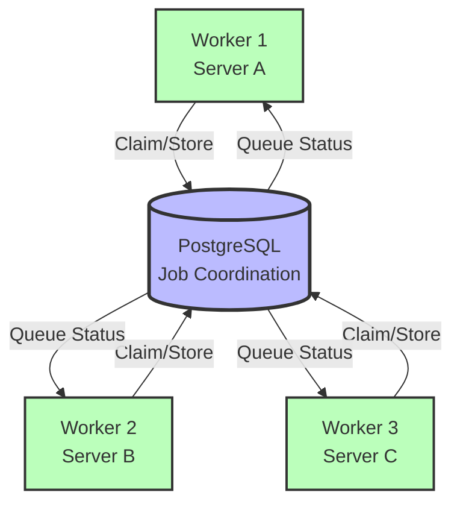

# Distributed Workers Example

This example demonstrates how to scale Go-Doc-Go horizontally by running multiple workers across different machines, all coordinating via PostgreSQL.

## What This Example Does

- Runs multiple worker processes on different machines
- Uses PostgreSQL for distributed job control and coordination
- Automatically distributes work across all workers
- Provides fault tolerance - if one worker crashes, others continue

## Architecture



## Prerequisites

### 1. PostgreSQL Database

```bash
# Install PostgreSQL
brew install postgresql  # macOS
# or use Docker
docker run --name godocgo-postgres \
  -e POSTGRES_PASSWORD=password \
  -e POSTGRES_DB=godocgo \
  -p 5432:5432 \
  -d postgres:15

# Wait for PostgreSQL to start
sleep 5
```

### 2. Build Worker Binary

```bash
cd ../../go
go build -o ../bin/goworker ./cmd/worker
cd ../examples/distributed-workers
```

### 3. Shared Storage (optional but recommended)

For production, use S3/MinIO for document storage so all workers can access the same files:

```bash
# Run MinIO locally for testing
docker run --name godocgo-minio \
  -p 9000:9000 \
  -p 9001:9001 \
  -e MINIO_ROOT_USER=minioadmin \
  -e MINIO_ROOT_PASSWORD=minioadmin \
  -d minio/minio server /data --console-address ":9001"

# Create bucket
docker exec godocgo-minio mc alias set local http://localhost:9000 minioadmin minioadmin
docker exec godocgo-minio mc mb local/documents
```

## Quick Start

### Single Machine Test (Multiple Processes)

Test distributed coordination on one machine first:

```bash
# Terminal 1 - Worker 1
../../bin/goworker --config config.toml --worker-id worker-01 --workers 4

# Terminal 2 - Worker 2
../../bin/goworker --config config.toml --worker-id worker-02 --workers 4

# Terminal 3 - Worker 3
../../bin/goworker --config config.toml --worker-id worker-03 --workers 4
```

You'll see workers coordinating automatically:
- One worker becomes the leader and enqueues documents
- All workers claim and process documents
- No duplicate processing

### Multi-Machine Deployment

#### On Server 1:

```bash
# Set worker ID
export WORKER_ID=server-01

# Run worker
../../bin/goworker --config config.toml --worker-id $WORKER_ID --workers 8
```

#### On Server 2:

```bash
# Set worker ID
export WORKER_ID=server-02

# Run worker
../../bin/goworker --config config.toml --worker-id $WORKER_ID --workers 8
```

#### On Server N:

```bash
# Set worker ID
export WORKER_ID=server-N

# Run worker
../../bin/goworker --config config.toml --worker-id $WORKER_ID --workers 8
```

## Configuration Explained

The `config.toml` file configures:

1. **PostgreSQL Job Control** - Coordinates workers across machines
2. **S3/MinIO Content Source** - Shared document storage (all workers can access)
3. **Worker Settings** - Heartbeat, timeouts, and claim settings
4. **Parquet Output** - Each worker writes to shared Parquet location

## Monitoring

### Check Worker Status

```sql
-- Connect to PostgreSQL
psql -h localhost -U postgres -d godocgo

-- View active workers
SELECT worker_id, last_heartbeat, documents_claimed
FROM worker_status
WHERE last_heartbeat > NOW() - INTERVAL '1 minute'
ORDER BY worker_id;

-- View queue depth
SELECT status, COUNT(*) as count
FROM document_queue
GROUP BY status;

-- View processing rate
SELECT
  worker_id,
  COUNT(*) as documents_processed,
  AVG(processing_time_ms) as avg_processing_time_ms
FROM document_processing_log
WHERE processed_at > NOW() - INTERVAL '1 hour'
GROUP BY worker_id
ORDER BY documents_processed DESC;
```

### Monitor Logs

```bash
# Worker logs show coordination
# Example output:

# Worker 1 (becomes leader):
# [INFO] No active leader found, becoming leader
# [INFO] Leader: Enqueued 1000 documents
# [INFO] Claimed document: doc-123
# [INFO] Processed document doc-123 (1.2s)

# Worker 2 (follower):
# [INFO] Leader active: worker-01
# [INFO] Claimed document: doc-456
# [INFO] Processed document doc-456 (1.5s)
```

## Performance Tuning

### Workers Per Machine

```toml
# In config.toml or via CLI
[workers]
workers = 8  # Start with number of CPU cores
```

Or via command line:
```bash
../../bin/goworker --config config.toml --workers 8
```

### Database Connection Pool

```toml
[processing.job_control.connection_pool]
max_connections = 20    # Per worker process
min_connections = 5
max_idle_time = 300     # seconds
```

### Claim Batching

Process multiple documents per claim to reduce database load:

```toml
[processing.job_control.claiming]
batch_size = 10         # Claim 10 documents at once
claim_timeout = 300     # 5 minutes per document
heartbeat_interval = 30 # Send heartbeat every 30 seconds
```

## Fault Tolerance

### Automatic Recovery

- **Worker crashes**: Claimed documents automatically released after 5 minutes
- **Leader crashes**: Another worker automatically becomes leader
- **Database connection loss**: Workers retry connection with exponential backoff

### Manual Recovery

```sql
-- Force release stuck claims (emergency)
UPDATE document_queue
SET status = 'pending', claimed_by = NULL, claimed_at = NULL
WHERE claimed_at < NOW() - INTERVAL '1 hour'
  AND status = 'claimed';

-- Reset specific worker's claims
UPDATE document_queue
SET status = 'pending', claimed_by = NULL, claimed_at = NULL
WHERE claimed_by = 'worker-01';
```

## Scaling Guidelines

### Small Scale (< 10,000 docs/hour)

- 2-3 workers, 4 goroutines each
- SQLite might be sufficient
- Single machine can handle this

### Medium Scale (10,000 - 100,000 docs/hour)

- 5-10 workers across 2-3 machines
- PostgreSQL required
- 8 goroutines per worker
- S3/MinIO for shared storage

### Large Scale (> 100,000 docs/hour)

- 20-50 workers across 5-10 machines
- PostgreSQL with connection pooling
- 16 goroutines per worker
- S3 for shared storage
- Parquet output to distributed filesystem

## Kubernetes Deployment

```yaml
# k8s-deployment.yaml
apiVersion: apps/v1
kind: Deployment
metadata:
  name: godocgo-workers
spec:
  replicas: 5  # 5 worker pods
  selector:
    matchLabels:
      app: godocgo-worker
  template:
    metadata:
      labels:
        app: godocgo-worker
    spec:
      containers:
      - name: worker
        image: godocgo:latest
        command: ["./bin/goworker"]
        args:
          - "--config"
          - "/config/config.toml"
          - "--worker-id"
          - "$(POD_NAME)"
          - "--workers"
          - "8"
        env:
        - name: POD_NAME
          valueFrom:
            fieldRef:
              fieldPath: metadata.name
        - name: POSTGRES_PASSWORD
          valueFrom:
            secretKeyRef:
              name: postgres-secret
              key: password
        volumeMounts:
        - name: config
          mountPath: /config
      volumes:
      - name: config
        configMap:
          name: godocgo-config
```

Deploy:

```bash
kubectl apply -f k8s-deployment.yaml

# Scale up/down
kubectl scale deployment godocgo-workers --replicas=10

# View logs
kubectl logs -l app=godocgo-worker --tail=100 -f
```

## Troubleshooting

### Workers not coordinating

```bash
# Check PostgreSQL connectivity from each worker
psql -h your-postgres-host -U postgres -d godocgo -c "SELECT 1"

# Verify workers are using same config
# (Config hash determines run_id for coordination)
```

### Duplicate processing

```sql
-- Check for duplicate claims
SELECT doc_id, COUNT(*) as claim_count
FROM document_queue
WHERE status = 'claimed'
GROUP BY doc_id
HAVING COUNT(*) > 1;

-- Should return no rows
```

### Poor performance

```bash
# Check database connection pool
# Too many workers can exhaust connections
# Rule of thumb: workers * goroutines * 2 < max_connections

# Check claim timeout
# If documents take > 5 minutes, increase timeout:
```

```toml
[processing.job_control.claiming]
claim_timeout = 600  # 10 minutes
```

## Next Steps

1. **Add embeddings**: Copy embedding config from [../semantic-search/](../semantic-search/)
2. **Monitor in production**: Add Prometheus metrics (see [../../docs/operations/monitoring.md](../../docs/operations/monitoring.md))
3. **Neo4j export**: Add graph database export (see [../neo4j-knowledge-graph/](../neo4j-knowledge-graph/))

## Related Documentation

- [Scaling Guide](../../docs/operations/scaling.md)
- [Monitoring Guide](../../docs/operations/monitoring.md)
- [Troubleshooting](../../docs/operations/troubleshooting.md)
