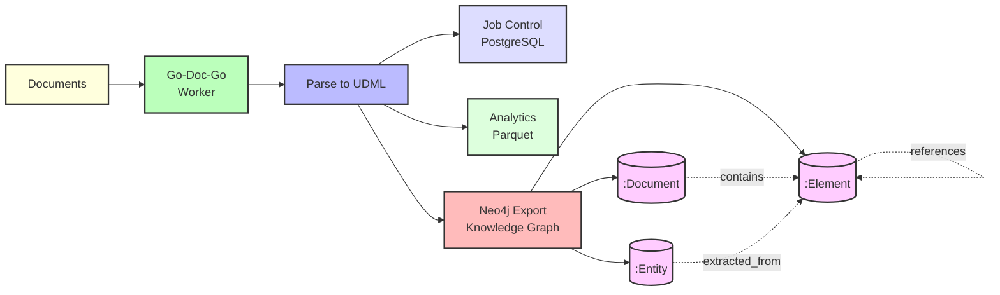

# Neo4j Knowledge Graph Example

This example demonstrates how to export processed documents to Neo4j for graph-based queries and relationship visualization.

## What This Example Does

- Processes documents with UDML extraction
- Exports elements and relationships to Neo4j graph database
- Enables powerful graph queries across document relationships
- Supports knowledge graph visualization

## Architecture



## Prerequisites

### 1. Neo4j Database

```bash
# Run Neo4j with Docker
docker run --name godocgo-neo4j \
  -p 7474:7474 -p 7687:7687 \
  -e NEO4J_AUTH=neo4j/password \
  -e NEO4J_PLUGINS='["apoc"]' \
  -d neo4j:5

# Wait for Neo4j to start (about 30 seconds)
sleep 30

# Access Neo4j Browser at http://localhost:7474
# Login: neo4j / password
```

### 2. Build Worker

```bash
cd ../../go
go build -o ../bin/goworker ./cmd/worker
cd ../examples/neo4j-knowledge-graph
```

## Quick Start

### 1. Add Sample Documents

```bash
mkdir -p docs
# Add PDFs, Word docs, or other files
cp /path/to/your/documents/*.pdf docs/
```

### 2. Run Worker with Neo4j Export

```bash
../../bin/goworker --config config.toml --max-documents 10
```

The worker will:
1. Process documents into UDML
2. Store analytics in Parquet
3. **Automatically export to Neo4j** when queue is empty

### 3. Query the Knowledge Graph

Open Neo4j Browser (http://localhost:7474) and try these queries:

#### View All Nodes

```cypher
MATCH (n)
RETURN n
LIMIT 50;
```

#### Find Document Structure

```cypher
// Show document hierarchy
MATCH path = (doc:Document)-[:CONTAINS*]->(element)
WHERE doc.doc_id = 'your-doc-id'
RETURN path
LIMIT 100;
```

#### Find Cross-Document References

```cypher
// Find documents that reference each other
MATCH (doc1:Document)-[:CONTAINS]->(e1:Element)-[:REFERENCES]->(e2:Element)<-[:CONTAINS]-(doc2:Document)
WHERE doc1 <> doc2
RETURN doc1.file_path, doc2.file_path, e1.element_type, e2.element_type
LIMIT 20;
```

#### Analyze Document Network

```cypher
// Find most connected documents
MATCH (doc:Document)-[:CONTAINS]->(e:Element)-[r]->(:Element)
RETURN doc.file_path, COUNT(r) as connection_count
ORDER BY connection_count DESC
LIMIT 10;
```

## Neo4j Schema

### Node Types

The worker creates the following node types:

```cypher
// Document nodes
(:Document {
  doc_id: string,
  source_name: string,
  file_path: string,
  file_size: int,
  created_at: datetime
})

// Element nodes
(:Element {
  element_id: string,
  doc_id: string,
  element_type: string,
  content_preview: string,
  page_number: int,
  position: int
})
```

### Relationship Types

```cypher
// Document structure
(:Document)-[:CONTAINS]->(:Element)

// Element hierarchy
(:Element)-[:CONTAINS]->(:Element)

// Sequential order
(:Element)-[:NEXT]->(:Element)

// Cross-references
(:Element)-[:REFERENCES]->(:Element)

// Links
(:Element)-[:LINKS_TO]->(:Element)
```

## Advanced Queries

### Find Tables in Documents

```cypher
MATCH (doc:Document)-[:CONTAINS]->(table:Element)
WHERE table.element_type = 'table'
RETURN doc.file_path, table.element_id, table.content_preview
LIMIT 10;
```

### Trace Element Lineage

```cypher
// Find parent chain for an element
MATCH path = (root:Document)-[:CONTAINS*]->(element:Element)
WHERE element.element_id = 'your-element-id'
RETURN path;
```

### Find Similar Content

```cypher
// Find elements with similar content (requires full-text index)
CALL db.index.fulltext.queryNodes("elementContent", "your search terms")
YIELD node, score
MATCH (doc:Document)-[:CONTAINS]->(node)
RETURN doc.file_path, node.element_type, node.content_preview, score
ORDER BY score DESC
LIMIT 10;
```

### Analyze Document Complexity

```cypher
// Count element types per document
MATCH (doc:Document)-[:CONTAINS]->(e:Element)
RETURN
  doc.file_path,
  e.element_type,
  COUNT(e) as count
ORDER BY doc.file_path, count DESC;
```

## With Ontology Extraction

When combined with ontology extraction, you get additional entity nodes:

```cypher
// Entity nodes (when ontology enabled)
(:Entity {
  entity_id: string,
  entity_type: string,
  name: string,
  confidence: float,
  domain: string
})

// Entity relationships
(:Entity)-[:EXTRACTED_FROM]->(:Element)
(:Entity)-[:RELATES_TO]->(:Entity)
```

### Query Entities

```cypher
// Find all entities of a type
MATCH (e:Entity)
WHERE e.entity_type = 'company'
RETURN e.name, e.confidence
ORDER BY e.confidence DESC
LIMIT 20;

// Find entity relationships
MATCH (e1:Entity)-[r:RELATES_TO]->(e2:Entity)
RETURN e1.name, type(r), e2.name, r.confidence
LIMIT 50;

// Trace entity to source document
MATCH (entity:Entity)-[:EXTRACTED_FROM]->(element:Element)<-[:CONTAINS]-(doc:Document)
WHERE entity.name = 'specific entity'
RETURN doc.file_path, element.content_preview;
```

## Performance Optimization

### Create Indexes

```cypher
// Document indexes
CREATE INDEX doc_id_index FOR (d:Document) ON (d.doc_id);
CREATE INDEX file_path_index FOR (d:Document) ON (d.file_path);

// Element indexes
CREATE INDEX element_id_index FOR (e:Element) ON (e.element_id);
CREATE INDEX element_type_index FOR (e:Element) ON (e.element_type);

// Entity indexes (if using ontologies)
CREATE INDEX entity_type_index FOR (e:Entity) ON (e.entity_type);
CREATE INDEX entity_name_index FOR (e:Entity) ON (e.name);

// Full-text search index
CREATE FULLTEXT INDEX elementContent FOR (e:Element) ON EACH [e.content_preview];
```

### Batch Export Settings

```toml
# In config.toml
[processing.neo4j_export]
batch_size = 1000        # Export 1000 nodes at a time
parallel_workers = 4     # Use 4 goroutines for export
max_retries = 3          # Retry failed exports
```

## Visualization

### Neo4j Browser

The Neo4j Browser provides interactive visualization:

```cypher
// Visualize document relationships
MATCH path = (doc1:Document)-[:CONTAINS]->(:Element)-[:REFERENCES]->(:Element)<-[:CONTAINS]-(doc2:Document)
WHERE doc1 <> doc2
RETURN path
LIMIT 50;
```

### Export for External Tools

```cypher
// Export to CSV for Gephi, Cytoscape, etc.
MATCH (n:Document)-[r]->(m)
RETURN
  n.doc_id as source,
  m.doc_id as target,
  type(r) as relationship
INTO 'file:///export/relationships.csv';
```

## Monitoring Export Status

```bash
# Check Neo4j export logs
../../bin/goworker --config config.toml 2>&1 | grep -i neo4j

# Example output:
# [INFO] Neo4j export: Starting batch export
# [INFO] Neo4j export: Exported 1000 documents
# [INFO] Neo4j export: Exported 5000 elements
# [INFO] Neo4j export: Exported 2000 relationships
# [INFO] Neo4j export: Complete (12.5s)
```

### Verify in Neo4j

```cypher
// Count nodes by type
MATCH (n)
RETURN labels(n) as type, COUNT(n) as count;

// Count relationships by type
MATCH ()-[r]->()
RETURN type(r), COUNT(r) as count;

// Check most recent import
MATCH (d:Document)
RETURN d.created_at, COUNT(d) as count
ORDER BY d.created_at DESC;
```

## Troubleshooting

### Connection refused

```bash
# Check Neo4j is running
docker ps | grep neo4j

# Check logs
docker logs godocgo-neo4j

# Test connection
curl http://localhost:7474
```

### Slow export

```toml
# Increase batch size
[processing.neo4j_export]
batch_size = 5000

# Use more workers
parallel_workers = 8
```

### Out of memory

```toml
# Reduce batch size
[processing.neo4j_export]
batch_size = 500

# Process fewer documents at once
```

```bash
../../bin/goworker --config config.toml --max-documents 100
```

## Next Steps

1. **Add ontology extraction**: See ontology examples for entity extraction
2. **Enable embeddings**: Combine with [../semantic-search/](../semantic-search/) for similarity queries
3. **Scale horizontally**: Use [../distributed-workers/](../distributed-workers/) pattern

## Related Documentation

- [Neo4j Export Configuration](../../docs/configuration/storage.md#neo4j-export)
- [UDML Specification](../../docs/features/udml/specification.md)
- [Ontology System](../../docs/features/ontology/README.md)
